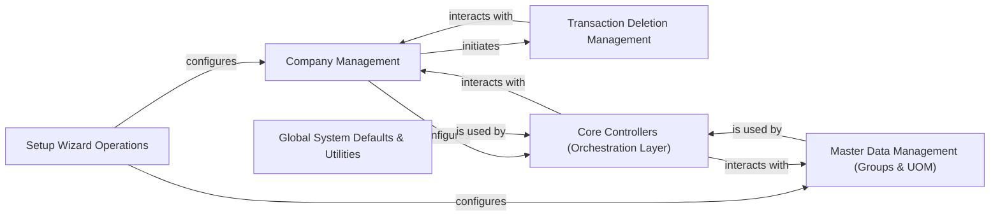

## Component Details

The "Core System & Master Data" component is the backbone of ERPNext, providing the foundational infrastructure, system-wide configurations, and master data essential for all other modules. It ensures data consistency, establishes system-wide defaults, and acts as a crucial orchestration layer for cross-module business logic.

### Company Management

This component is responsible for the creation, configuration, and validation of company-specific settings. It manages critical financial and operational defaults such as default accounts, currency, and tax templates, which are fundamental for the initial setup and ongoing operations of each company within ERPNext.

**Related Classes/Methods**:

- <a href="https://github.com/frappe/erpnext/blob/master/erpnext/setup/doctype/company/company.py#L1-L1" target="_blank" rel="noopener noreferrer">`erpnext/setup/doctype/company/company.py` (1:1)</a>

### Master Data Management (Groups & UOM)

This component provides the framework for defining and managing foundational business entities. It includes Item Groups, Customer Groups, Supplier Groups, and Units of Measure (UOM). By standardizing these entities, it ensures data consistency across the system, directly impacting pricing, reporting, inventory management, and sales/purchase processes.

**Related Classes/Methods**:

- <a href="https://github.com/frappe/erpnext/blob/master/erpnext/setup/doctype/item_group/item_group.py#L1-L1" target="_blank" rel="noopener noreferrer">`erpnext/setup/doctype/item_group/item_group.py` (1:1)</a>

- <a href="https://github.com/frappe/erpnext/blob/master/erpnext/setup/doctype/customer_group/customer_group.py#L1-L1" target="_blank" rel="noopener noreferrer">`erpnext/setup/doctype/customer_group/customer_group.py` (1:1)</a>

- <a href="https://github.com/frappe/erpnext/blob/master/erpnext/setup/doctype/supplier_group/supplier_group.py#L1-L1" target="_blank" rel="noopener noreferrer">`erpnext/setup/doctype/supplier_group/supplier_group.py` (1:1)</a>

- <a href="https://github.com/frappe/erpnext/blob/master/erpnext/setup/doctype/uom/uom.py#L1-L1" target="_blank" rel="noopener noreferrer">`erpnext/setup/doctype/uom/uom.py` (1:1)</a>

### Global System Defaults & Utilities

This component handles system-wide default settings and provides a collection of general utility functions. These utilities are leveraged by various modules for common operations, ensuring consistent behavior, data handling, and adherence to global configurations throughout the ERPNext system.

**Related Classes/Methods**:

- <a href="https://github.com/frappe/erpnext/blob/master/erpnext/setup/doctype/global_defaults/global_defaults.py#L1-L1" target="_blank" rel="noopener noreferrer">`erpnext/setup/doctype/global_defaults/global_defaults.py` (1:1)</a>

- <a href="https://github.com/frappe/erpnext/blob/master/erpnext/setup/utils.py#L1-L1" target="_blank" rel="noopener noreferrer">`erpnext/setup/utils.py` (1:1)</a>

### Setup Wizard Operations

This component facilitates the initial setup of ERPNext instances and new companies. It automates the installation of essential default data, configurations, and fixtures, such as market segments, sales stages, and UOM data, streamlining the onboarding process.

**Related Classes/Methods**:

- <a href="https://github.com/frappe/erpnext/blob/master/erpnext/setup/setup_wizard/operations/install_fixtures.py#L1-L1" target="_blank" rel="noopener noreferrer">`erpnext/setup/setup_wizard/operations/install_fixtures.py` (1:1)</a>

- <a href="https://github.com/frappe/erpnext/blob/master/erpnext/setup/setup_wizard/operations/company_setup.py#L1-L1" target="_blank" rel="noopener noreferrer">`erpnext/setup/setup_wizard/operations/company_setup.py` (1:1)</a>

- <a href="https://github.com/frappe/erpnext/blob/master/erpnext/setup/setup_wizard/operations/defaults_setup.py#L1-L1" target="_blank" rel="noopener noreferrer">`erpnext/setup/setup_wizard/operations/defaults_setup.py` (1:1)</a>

### Transaction Deletion Management

This component manages the secure and consistent deletion of transactional data. It is particularly crucial when a company or related records are removed, ensuring that all linked records across various doctypes are identified and processed correctly to maintain data integrity and prevent orphaned records.

**Related Classes/Methods**:

- <a href="https://github.com/frappe/erpnext/blob/master/erpnext/setup/doctype/transaction_deletion_record/transaction_deletion_record.py#L1-L1" target="_blank" rel="noopener noreferrer">`erpnext/setup/doctype/transaction_deletion_record/transaction_deletion_record.py` (1:1)</a>

### Core Controllers (Orchestration Layer)

This component acts as the primary orchestration layer for core business logic. It manages interactions, validations, and calculations across different functional modules such as Accounts, Buying, Selling, and Stock. These controllers ensure the integrity and consistency of transactional data and business processes by enforcing business rules and coordinating data flow.

**Related Classes/Methods**:

- <a href="https://github.com/frappe/erpnext/blob/master/erpnext/controllers/accounts_controller.py#L1-L1" target="_blank" rel="noopener noreferrer">`erpnext/controllers/accounts_controller.py` (1:1)</a>

- <a href="https://github.com/frappe/erpnext/blob/master/erpnext/controllers/buying_controller.py#L1-L1" target="_blank" rel="noopener noreferrer">`erpnext/controllers/buying_controller.py` (1:1)</a>

- <a href="https://github.com/frappe/erpnext/blob/master/erpnext/controllers/selling_controller.py#L1-L1" target="_blank" rel="noopener noreferrer">`erpnext/controllers/selling_controller.py` (1:1)</a>

- <a href="https://github.com/frappe/erpnext/blob/master/erpnext/controllers/stock_controller.py#L1-L1" target="_blank" rel="noopener noreferrer">`erpnext/controllers/stock_controller.py` (1:1)</a>

- <a href="https://github.com/frappe/erpnext/blob/master/erpnext/controllers/budget_controller.py#L1-L1" target="_blank" rel="noopener noreferrer">`erpnext/controllers/budget_controller.py` (1:1)</a>

- <a href="https://github.com/frappe/erpnext/blob/master/erpnext/controllers/taxes_and_totals.py#L1-L1" target="_blank" rel="noopener noreferrer">`erpnext/controllers/taxes_and_totals.py` (1:1)</a>

- <a href="https://github.com/frappe/erpnext/blob/master/erpnext/controllers/sales_and_purchase_return.py#L1-L1" target="_blank" rel="noopener noreferrer">`erpnext/controllers/sales_and_purchase_return.py` (1:1)</a>

### [FAQ](https://github.com/CodeBoarding/GeneratedOnBoardings/tree/main?tab=readme-ov-file#faq)