```mermaid

graph LR

    erpnext_accounts_general_ledger["erpnext.accounts.general_ledger"]

    erpnext_accounts_doctype_journal_entry_journal_entry["erpnext.accounts.doctype.journal_entry.journal_entry"]

    erpnext_accounts_doctype_account_account["erpnext.accounts.doctype.account.account"]

    erpnext_accounts_doctype_sales_invoice_sales_invoice["erpnext.accounts.doctype.sales_invoice.sales_invoice"]

    erpnext_accounts_doctype_purchase_invoice_purchase_invoice["erpnext.accounts.doctype.purchase_invoice.purchase_invoice"]

    erpnext_accounts_doctype_payment_entry_payment_entry["erpnext.accounts.doctype.payment_entry.payment_entry"]

    erpnext_accounts_doctype_bank_account_bank_account["erpnext.accounts.doctype.bank_account.bank_account"]

    erpnext_accounts_doctype_bank_reconciliation_tool_bank_reconciliation_tool["erpnext.accounts.doctype.bank_reconciliation_tool.bank_reconciliation_tool"]

    erpnext_controllers_accounts_controller["erpnext.controllers.accounts_controller"]

    erpnext_accounts_report["erpnext.accounts.report"]

    erpnext_accounts_general_ledger -- "receives entries from" --> erpnext_accounts_doctype_journal_entry_journal_entry

    erpnext_accounts_general_ledger -- "receives entries from" --> erpnext_accounts_doctype_sales_invoice_sales_invoice

    erpnext_accounts_doctype_journal_entry_journal_entry -- "posts to" --> erpnext_accounts_general_ledger

    erpnext_accounts_doctype_journal_entry_journal_entry -- "interacts with" --> erpnext_controllers_accounts_controller

    erpnext_accounts_doctype_account_account -- "forms the backbone for" --> erpnext_accounts_general_ledger

    erpnext_accounts_doctype_account_account -- "is utilized by" --> erpnext_accounts_utils

    erpnext_accounts_doctype_sales_invoice_sales_invoice -- "posts to" --> erpnext_accounts_general_ledger

    erpnext_accounts_doctype_sales_invoice_sales_invoice -- "interacts with" --> erpnext_controllers_taxes_and_totals

    erpnext_accounts_doctype_purchase_invoice_purchase_invoice -- "posts to" --> erpnext_accounts_general_ledger

    erpnext_accounts_doctype_purchase_invoice_purchase_invoice -- "interacts with" --> erpnext_controllers_taxes_and_totals

    erpnext_accounts_doctype_payment_entry_payment_entry -- "posts to" --> erpnext_accounts_general_ledger

    erpnext_accounts_doctype_payment_entry_payment_entry -- "updates" --> erpnext_accounts_doctype_bank_account_bank_account

    erpnext_accounts_doctype_bank_account_bank_account -- "is referenced by" --> erpnext_accounts_doctype_payment_entry_payment_entry

    erpnext_accounts_doctype_bank_account_bank_account -- "is used by" --> erpnext_accounts_doctype_bank_reconciliation_tool_bank_reconciliation_tool

    erpnext_accounts_doctype_bank_reconciliation_tool_bank_reconciliation_tool -- "processes data from" --> erpnext_accounts_doctype_bank_account_bank_account

    erpnext_accounts_doctype_bank_reconciliation_tool_bank_reconciliation_tool -- "utilizes" --> erpnext_accounts_utils

    erpnext_controllers_accounts_controller -- "validates and processes" --> erpnext_accounts_doctype_journal_entry_journal_entry

    erpnext_controllers_accounts_controller -- "validates and processes" --> erpnext_accounts_doctype_sales_invoice_sales_invoice

    erpnext_accounts_report -- "queries data from" --> erpnext_accounts_general_ledger

    erpnext_accounts_report -- "utilizes" --> erpnext_accounts_doctype_account_account

```

## Component Details

The Financial Management component in ERPNext, primarily encapsulated within erpnext.accounts, serves as the core accounting and financial engine. It manages the general ledger, processes all financial transactions, handles payments, reconciles bank accounts, and ensures tax compliance. Its fundamental purpose is to maintain accurate, integrated, and compliant financial records for the entire ERP system.

### erpnext.accounts.general_ledger

This is the central ledger where all financial transactions are ultimately recorded. It ensures adherence to double-entry accounting principles by processing and maintaining a chronological record of all debits and credits.

**Related Classes/Methods**:

- <a href="https://github.com/frappe/erpnext/blob/master/erpnext/accounts/general_ledger.py#L1-L1" target="_blank" rel="noopener noreferrer">`erpnext.accounts.general_ledger` (1:1)</a>

### erpnext.accounts.doctype.journal_entry.journal_entry

Represents a direct financial transaction that debits and credits accounts in the General Ledger. It's used for various accounting adjustments, opening balances, and non-standard financial movements not covered by other specific documents.

**Related Classes/Methods**:

- <a href="https://github.com/frappe/erpnext/blob/master/erpnext/accounts/doctype/journal_entry/journal_entry.py#L1-L1" target="_blank" rel="noopener noreferrer">`erpnext.accounts.doctype.journal_entry.journal_entry` (1:1)</a>

### erpnext.accounts.doctype.account.account

Defines the Chart of Accounts, which is the hierarchical structure of all financial accounts (e.g., Assets, Liabilities, Equity, Income, Expenses) used by the company. It's crucial for organizing and categorizing financial data.

**Related Classes/Methods**:

- <a href="https://github.com/frappe/erpnext/blob/master/erpnext/accounts/doctype/account/account.py#L1-L1" target="_blank" rel="noopener noreferrer">`erpnext.accounts.doctype.account.account` (1:1)</a>

### erpnext.accounts.doctype.sales_invoice.sales_invoice

Manages the billing process for goods sold or services rendered to customers. It generates the necessary financial entries for revenue recognition and accounts receivable in the General Ledger.

**Related Classes/Methods**:

- <a href="https://github.com/frappe/erpnext/blob/master/erpnext/accounts/doctype/sales_invoice/sales_invoice.py#L1-L1" target="_blank" rel="noopener noreferrer">`erpnext.accounts.doctype.sales_invoice.sales_invoice` (1:1)</a>

### erpnext.accounts.doctype.purchase_invoice.purchase_invoice

Manages the recording of bills received from suppliers for goods purchased or services consumed. It generates financial entries for expenses and accounts payable in the General Ledger.

**Related Classes/Methods**:

- <a href="https://github.com/frappe/erpnext/blob/master/erpnext/accounts/doctype/purchase_invoice/purchase_invoice.py#L1-L1" target="_blank" rel="noopener noreferrer">`erpnext.accounts.doctype.purchase_invoice.purchase_invoice` (1:1)</a>

### erpnext.accounts.doctype.payment_entry.payment_entry

The central document for recording all cash and bank transactions, including customer payments, supplier payments, and internal fund transfers. It updates relevant bank and ledger accounts.

**Related Classes/Methods**:

- <a href="https://github.com/frappe/erpnext/blob/master/erpnext/accounts/doctype/payment_entry/payment_entry.py#L1-L1" target="_blank" rel="noopener noreferrer">`erpnext.accounts.doctype.payment_entry.payment_entry` (1:1)</a>

### erpnext.accounts.doctype.bank_account.bank_account

Manages the details of all bank accounts used by the company, including account numbers, bank names, and their corresponding General Ledger accounts.

**Related Classes/Methods**:

- <a href="https://github.com/frappe/erpnext/blob/master/erpnext/accounts/doctype/bank_account/bank_account.py#L1-L1" target="_blank" rel="noopener noreferrer">`erpnext.accounts.doctype.bank_account.bank_account` (1:1)</a>

### erpnext.accounts.doctype.bank_reconciliation_tool.bank_reconciliation_tool

Provides the functionality to reconcile bank statements with the company's internal bank transactions recorded in ERPNext, identifying and resolving discrepancies to ensure accurate cash balances.

**Related Classes/Methods**:

- <a href="https://github.com/frappe/erpnext/blob/master/erpnext/accounts/doctype/bank_reconciliation_tool/bank_reconciliation_tool.py#L1-L1" target="_blank" rel="noopener noreferrer">`erpnext.accounts.doctype.bank_reconciliation_tool.bank_reconciliation_tool` (1:1)</a>

### erpnext.controllers.accounts_controller

A central controller that encapsulates common business logic, validations, and processing routines for various accounting documents (e.g., Journal Entry, Sales Invoice, Payment Entry). It acts as an orchestrator for financial operations, ensuring consistency and compliance.

**Related Classes/Methods**:

- <a href="https://github.com/frappe/erpnext/blob/master/erpnext/controllers/accounts_controller.py#L1-L1" target="_blank" rel="noopener noreferrer">`erpnext.controllers.accounts_controller` (1:1)</a>

### erpnext.accounts.report

This package contains all the financial reports that provide insights into the company's financial performance and position. This includes standard reports like Balance Sheet, Profit & Loss, Trial Balance, General Ledger, and various accounts receivable/payable reports.

**Related Classes/Methods**:

- `erpnext.accounts.report` (1:1)

### [FAQ](https://github.com/CodeBoarding/GeneratedOnBoardings/tree/main?tab=readme-ov-file#faq)