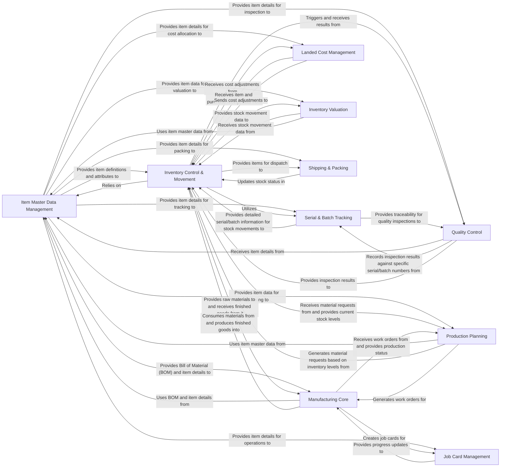

## Component Details

One paragraph explaining the functionality which is represented by this graph. What the main flow is and what is its purpose.

### Item Master Data Management

This foundational component manages all static and descriptive information about items. This includes defining item attributes, managing barcodes, setting up pricing rules, and configuring reorder levels. It serves as the single source of truth for all item-related data across the ERP system.

**Related Classes/Methods**:

- <a href="https://github.com/frappe/erpnext/blob/master/erpnext/stock/doctype/item/item.py#L0-L0" target="_blank" rel="noopener noreferrer">`erpnext.stock.doctype.item.item` (0:0)</a>

- <a href="https://github.com/frappe/erpnext/blob/master/erpnext/stock/doctype/item_attribute/item_attribute.py#L0-L0" target="_blank" rel="noopener noreferrer">`erpnext.stock.doctype.item_attribute.item_attribute` (0:0)</a>

- <a href="https://github.com/frappe/erpnext/blob/master/erpnext/stock/doctype/item_price/item_price.py#L0-L0" target="_blank" rel="noopener noreferrer">`erpnext.stock.doctype.item_price.item_price` (0:0)</a>

- <a href="https://github.com/frappe/erpnext/blob/master/erpnext/stock/doctype/price_list/price_list.py#L0-L0" target="_blank" rel="noopener noreferrer">`erpnext.stock.doctype.price_list.price_list` (0:0)</a>

- <a href="https://github.com/frappe/erpnext/blob/master/erpnext/stock/doctype/item_reorder/item_reorder.py#L0-L0" target="_blank" rel="noopener noreferrer">`erpnext.stock.doctype.item_reorder.item_reorder` (0:0)</a>

- <a href="https://github.com/frappe/erpnext/blob/master/erpnext/stock/get_item_details.py#L58-L156" target="_blank" rel="noopener noreferrer">`erpnext.stock.get_item_details` (58:156)</a>

- <a href="https://github.com/frappe/erpnext/blob/master/erpnext/stock/doctype/item_barcode/item_barcode.py#L0-L0" target="_blank" rel="noopener noreferrer">`erpnext.stock.doctype.item_barcode.item_barcode` (0:0)</a>

### Inventory Control & Movement

This core component is responsible for tracking real-time stock levels and managing all physical movements of goods. This includes recording stock receipts (e.g., from purchases or production), issues (e.g., for sales or consumption), internal transfers between warehouses, and adjustments for discrepancies. It relies heavily on the StockController (within erpnext.controllers.stock_controller) to validate and process these movements and generate corresponding ledger entries.

**Related Classes/Methods**:

- <a href="https://github.com/frappe/erpnext/blob/master/erpnext/stock/doctype/stock_entry/stock_entry.py#L0-L0" target="_blank" rel="noopener noreferrer">`erpnext.stock.doctype.stock_entry.stock_entry` (0:0)</a>

- <a href="https://github.com/frappe/erpnext/blob/master/erpnext/stock/doctype/warehouse/warehouse.py#L0-L0" target="_blank" rel="noopener noreferrer">`erpnext.stock.doctype.warehouse.warehouse` (0:0)</a>

- <a href="https://github.com/frappe/erpnext/blob/master/erpnext/stock/doctype/bin/bin.py#L0-L0" target="_blank" rel="noopener noreferrer">`erpnext.stock.doctype.bin.bin` (0:0)</a>

- <a href="https://github.com/frappe/erpnext/blob/master/erpnext/stock/doctype/delivery_note/delivery_note.py#L0-L0" target="_blank" rel="noopener noreferrer">`erpnext.stock.doctype.delivery_note.delivery_note` (0:0)</a>

- <a href="https://github.com/frappe/erpnext/blob/master/erpnext/stock/doctype/purchase_receipt/purchase_receipt.py#L0-L0" target="_blank" rel="noopener noreferrer">`erpnext.stock.doctype.purchase_receipt.purchase_receipt` (0:0)</a>

- <a href="https://github.com/frappe/erpnext/blob/master/erpnext/stock/doctype/stock_reconciliation/stock_reconciliation.py#L0-L0" target="_blank" rel="noopener noreferrer">`erpnext.stock.doctype.stock_reconciliation.stock_reconciliation` (0:0)</a>

- <a href="https://github.com/frappe/erpnext/blob/master/erpnext/stock/stock_balance.py#L0-L0" target="_blank" rel="noopener noreferrer">`erpnext.stock.stock_balance` (0:0)</a>

- <a href="https://github.com/frappe/erpnext/blob/master/erpnext/stock/stock_ledger.py#L0-L0" target="_blank" rel="noopener noreferrer">`erpnext.stock.stock_ledger` (0:0)</a>

- <a href="https://github.com/frappe/erpnext/blob/master/erpnext/stock/doctype/stock_ledger_entry/stock_ledger_entry.py#L0-L0" target="_blank" rel="noopener noreferrer">`erpnext.stock.doctype.stock_ledger_entry.stock_ledger_entry` (0:0)</a>

- <a href="https://github.com/frappe/erpnext/blob/master/erpnext/stock/doctype/stock_entry_detail/stock_entry_detail.py#L0-L0" target="_blank" rel="noopener noreferrer">`erpnext.stock.doctype.stock_entry_detail.stock_entry_detail` (0:0)</a>

- <a href="https://github.com/frappe/erpnext/blob/master/erpnext/stock/doctype/putaway_rule/putaway_rule.py#L0-L0" target="_blank" rel="noopener noreferrer">`erpnext.stock.doctype.putaway_rule.putaway_rule` (0:0)</a>

### Serial & Batch Tracking

This component provides granular control over inventory by managing unique serial numbers for individual items and batch numbers for groups of items. It enables traceability, warranty tracking, and expiry date management, which are vital for industries with strict regulatory requirements or perishable goods.

**Related Classes/Methods**:

- <a href="https://github.com/frappe/erpnext/blob/master/erpnext/stock/doctype/serial_no/serial_no.py#L0-L0" target="_blank" rel="noopener noreferrer">`erpnext.stock.doctype.serial_no.serial_no` (0:0)</a>

- <a href="https://github.com/frappe/erpnext/blob/master/erpnext/stock/doctype/batch/batch.py#L0-L0" target="_blank" rel="noopener noreferrer">`erpnext.stock.doctype.batch.batch` (0:0)</a>

- <a href="https://github.com/frappe/erpnext/blob/master/erpnext/stock/doctype/serial_and_batch_bundle/serial_and_batch_bundle.py#L0-L0" target="_blank" rel="noopener noreferrer">`erpnext.stock.doctype.serial_and_batch_bundle.serial_and_batch_bundle` (0:0)</a>

- <a href="https://github.com/frappe/erpnext/blob/master/erpnext/stock/serial_batch_bundle.py#L0-L0" target="_blank" rel="noopener noreferrer">`erpnext.stock.serial_batch_bundle` (0:0)</a>

- <a href="https://github.com/frappe/erpnext/blob/master/erpnext/stock/doctype/serial_and_batch_entry/serial_and_batch_entry.py#L0-L0" target="_blank" rel="noopener noreferrer">`erpnext.stock.doctype.serial_and_batch_entry.serial_and_batch_entry` (0:0)</a>

### Quality Control

This component integrates quality assurance into inventory and manufacturing processes. It allows for the definition of quality inspection templates and parameters, facilitating inspections at various stages (e.g., incoming materials, in-process, final product) to ensure goods meet specified quality standards.

**Related Classes/Methods**:

- <a href="https://github.com/frappe/erpnext/blob/master/erpnext/stock/doctype/quality_inspection/quality_inspection.py#L0-L0" target="_blank" rel="noopener noreferrer">`erpnext.stock.doctype.quality_inspection.quality_inspection` (0:0)</a>

- <a href="https://github.com/frappe/erpnext/blob/master/erpnext/stock/doctype/quality_inspection_template/quality_inspection_template.py#L0-L0" target="_blank" rel="noopener noreferrer">`erpnext.stock.doctype.quality_inspection_template.quality_inspection_template` (0:0)</a>

- <a href="https://github.com/frappe/erpnext/blob/master/erpnext/stock/doctype/quality_inspection_parameter/quality_inspection_parameter.py#L0-L0" target="_blank" rel="noopener noreferrer">`erpnext.stock.doctype.quality_inspection_parameter.quality_inspection_parameter` (0:0)</a>

- <a href="https://github.com/frappe/erpnext/blob/master/erpnext/stock/doctype/quality_inspection_parameter_group/quality_inspection_parameter_group.py#L0-L0" target="_blank" rel="noopener noreferrer">`erpnext.stock.doctype.quality_inspection_parameter_group.quality_inspection_parameter_group` (0:0)</a>

- <a href="https://github.com/frappe/erpnext/blob/master/erpnext/stock/doctype/quality_inspection_reading/quality_inspection_reading.py#L0-L0" target="_blank" rel="noopener noreferrer">`erpnext.stock.doctype.quality_inspection_reading.quality_inspection_reading` (0:0)</a>

### Manufacturing Core

This is the heart of the manufacturing operations. It defines how products are assembled or produced through Bills of Material (BOMs), which list the raw materials and operations required. Work Orders then translate these BOMs into actionable production tasks, tracking material consumption and finished goods production.

**Related Classes/Methods**:

- <a href="https://github.com/frappe/erpnext/blob/master/erpnext/manufacturing/doctype/bom/bom.py#L0-L0" target="_blank" rel="noopener noreferrer">`erpnext.manufacturing.doctype.bom.bom` (0:0)</a>

- <a href="https://github.com/frappe/erpnext/blob/master/erpnext/manufacturing/doctype/work_order/work_order.py#L0-L0" target="_blank" rel="noopener noreferrer">`erpnext.manufacturing.doctype.work_order.work_order` (0:0)</a>

- <a href="https://github.com/frappe/erpnext/blob/master/erpnext/manufacturing/doctype/operation/operation.py#L0-L0" target="_blank" rel="noopener noreferrer">`erpnext.manufacturing.doctype.operation.operation` (0:0)</a>

- <a href="https://github.com/frappe/erpnext/blob/master/erpnext/manufacturing/doctype/routing/routing.py#L0-L0" target="_blank" rel="noopener noreferrer">`erpnext.manufacturing.doctype.routing.routing` (0:0)</a>

- <a href="https://github.com/frappe/erpnext/blob/master/erpnext/manufacturing/doctype/workstation/workstation.py#L0-L0" target="_blank" rel="noopener noreferrer">`erpnext.manufacturing.doctype.workstation.workstation` (0:0)</a>

### Production Planning

This component focuses on optimizing manufacturing schedules and resource allocation. It generates material requests based on sales orders or projected demand and creates detailed production plans to ensure that manufacturing processes are aligned with business needs and inventory availability.

**Related Classes/Methods**:

- <a href="https://github.com/frappe/erpnext/blob/master/erpnext/manufacturing/doctype/production_plan/production_plan.py#L0-L0" target="_blank" rel="noopener noreferrer">`erpnext.manufacturing.doctype.production_plan.production_plan` (0:0)</a>

- <a href="https://github.com/frappe/erpnext/blob/master/erpnext/stock/doctype/material_request/material_request.py#L0-L0" target="_blank" rel="noopener noreferrer">`erpnext.stock.doctype.material_request.material_request` (0:0)</a>

### Job Card Management

This component breaks down work orders into smaller, trackable job cards, representing individual operations or tasks. It allows for detailed tracking of time spent, resources consumed, and progress at each workstation, providing granular control and visibility into the production floor.

**Related Classes/Methods**:

- <a href="https://github.com/frappe/erpnext/blob/master/erpnext/manufacturing/doctype/job_card/job_card.py#L0-L0" target="_blank" rel="noopener noreferrer">`erpnext.manufacturing.doctype.job_card.job_card` (0:0)</a>

- <a href="https://github.com/frappe/erpnext/blob/master/erpnext/manufacturing/doctype/downtime_entry/downtime_entry.py#L0-L0" target="_blank" rel="noopener noreferrer">`erpnext.manufacturing.doctype.downtime_entry.downtime_entry` (0:0)</a>

### Landed Cost Management

This component is crucial for accurately determining the true cost of purchased items. It allows for the allocation of additional costs, such as freight, customs duties, and insurance, to the cost of goods, which directly impacts inventory valuation and profitability analysis.

**Related Classes/Methods**:

- <a href="https://github.com/frappe/erpnext/blob/master/erpnext/stock/doctype/landed_cost_voucher/landed_cost_voucher.py#L0-L0" target="_blank" rel="noopener noreferrer">`erpnext.stock.doctype.landed_cost_voucher.landed_cost_voucher` (0:0)</a>

- <a href="https://github.com/frappe/erpnext/blob/master/erpnext/stock/doctype/landed_cost_item/landed_cost_item.py#L0-L0" target="_blank" rel="noopener noreferrer">`erpnext.stock.doctype.landed_cost_item.landed_cost_item` (0:0)</a>

- <a href="https://github.com/frappe/erpnext/blob/master/erpnext/stock/doctype/landed_cost_purchase_receipt/landed_cost_purchase_receipt.py#L0-L0" target="_blank" rel="noopener noreferrer">`erpnext.stock.doctype.landed_cost_purchase_receipt.landed_cost_purchase_receipt` (0:0)</a>

- <a href="https://github.com/frappe/erpnext/blob/master/erpnext/stock/doctype/landed_cost_taxes_and_charges/landed_cost_taxes_and_charges.py#L0-L0" target="_blank" rel="noopener noreferrer">`erpnext.stock.doctype.landed_cost_taxes_and_charges.landed_cost_taxes_and_charges` (0:0)</a>

### Inventory Valuation

This component defines and applies various accounting methods (e.g., FIFO, LIFO, Weighted Average) for valuing inventory. It also handles the reposting of item valuations, ensuring that the financial value of inventory accurately reflects the chosen accounting principles.

**Related Classes/Methods**:

- <a href="https://github.com/frappe/erpnext/blob/master/erpnext/stock/valuation.py#L0-L0" target="_blank" rel="noopener noreferrer">`erpnext.stock.valuation` (0:0)</a>

- <a href="https://github.com/frappe/erpnext/blob/master/erpnext/stock/doctype/repost_item_valuation/repost_item_valuation.py#L0-L0" target="_blank" rel="noopener noreferrer">`erpnext.stock.doctype.repost_item_valuation.repost_item_valuation` (0:0)</a>

- <a href="https://github.com/frappe/erpnext/blob/master/erpnext/stock/doctype/stock_ledger_entry/stock_ledger_entry.py#L0-L0" target="_blank" rel="noopener noreferrer">`erpnext.stock.doctype.stock_ledger_entry.stock_ledger_entry` (0:0)</a>

### Shipping & Packing

This component manages the final stages of outbound logistics. It facilitates the creation of packing slips, organizes items into parcels, and manages delivery trips, ensuring that goods are correctly prepared and dispatched to customers or other destinations.

**Related Classes/Methods**:

- <a href="https://github.com/frappe/erpnext/blob/master/erpnext/stock/doctype/packing_slip/packing_slip.py#L0-L0" target="_blank" rel="noopener noreferrer">`erpnext.stock.doctype.packing_slip.packing_slip` (0:0)</a>

- <a href="https://github.com/frappe/erpnext/blob/master/erpnext/stock/doctype/shipment/shipment.py#L0-L0" target="_blank" rel="noopener noreferrer">`erpnext.stock.doctype.shipment.shipment` (0:0)</a>

- <a href="https://github.com/frappe/erpnext/blob/master/erpnext/stock/doctype/delivery_trip/delivery_trip.py#L0-L0" target="_blank" rel="noopener noreferrer">`erpnext.stock.doctype.delivery_trip.delivery_trip` (0:0)</a>

- <a href="https://github.com/frappe/erpnext/blob/master/erpnext/stock/doctype/packed_item/packed_item.py#L0-L0" target="_blank" rel="noopener noreferrer">`erpnext.stock.doctype.packed_item.packed_item` (0:0)</a>

- <a href="https://github.com/frappe/erpnext/blob/master/erpnext/stock/doctype/delivery_note/delivery_note.py#L0-L0" target="_blank" rel="noopener noreferrer">`erpnext.stock.doctype.delivery_note.delivery_note` (0:0)</a>

- <a href="https://github.com/frappe/erpnext/blob/master/erpnext/stock/doctype/shipment_parcel/shipment_parcel.py#L0-L0" target="_blank" rel="noopener noreferrer">`erpnext.stock.doctype.shipment_parcel.shipment_parcel` (0:0)</a>

- <a href="https://github.com/frappe/erpnext/blob/master/erpnext/stock/doctype/pick_list/pick_list.py#L0-L0" target="_blank" rel="noopener noreferrer">`erpnext.stock.doctype.pick_list.pick_list` (0:0)</a>

### [FAQ](https://github.com/CodeBoarding/GeneratedOnBoardings/tree/main?tab=readme-ov-file#faq)