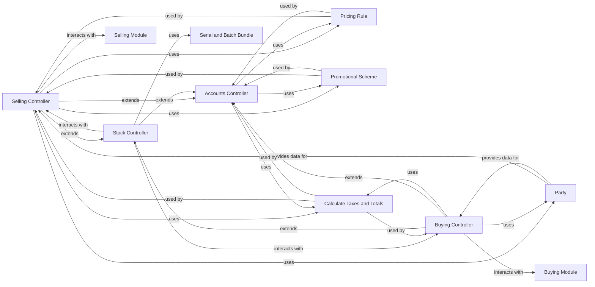

## Component Details

The `Sales & Procurement Management` component in ERPNext is a critical subsystem that orchestrates the entire lifecycle of customer and supplier interactions. It encompasses sales processes from quotations to invoicing and procurement processes from purchase orders to purchase invoices. This component also manages party (customer/supplier) master data and applies pricing and promotional rules.

### Selling Controller

This controller is responsible for the business logic specific to sales documents (Sales Order, Delivery Note, Sales Invoice, Quotation). It handles validations related to selling prices, discounts, customer addresses, and updates stock ledgers based on sales transactions. It ensures that sales processes adhere to defined business rules and integrates with inventory and accounting.

**Related Classes/Methods**:

- <a href="https://github.com/frappe/erpnext/blob/master/erpnext/controllers/selling_controller.py#L17-L944" target="_blank" rel="noopener noreferrer">`erpnext.controllers.selling_controller.SellingController` (17:944)</a>

### Buying Controller

This controller manages the business logic for procurement documents (Purchase Order, Purchase Receipt, Purchase Invoice). It handles validations for items, stock units of measure (UOM), supplier addresses, and asset returns. It also plays a role in processing fixed assets and ensures procurement processes are correctly executed.

**Related Classes/Methods**:

- <a href="https://github.com/frappe/erpnext/blob/master/erpnext/controllers/buying_controller.py#L27-L1069" target="_blank" rel="noopener noreferrer">`erpnext.controllers.buying_controller.BuyingController` (27:1069)</a>

### Stock Controller

This controller is a foundational component for managing all inventory-related operations. It validates serial and batch numbers, processes stock entries, and generates Stock Ledger (SL) entries. It ensures the integrity and accuracy of inventory data, which is directly impacted by both sales and procurement activities. Both `SellingController` and `BuyingController` inherit from `StockController`.

**Related Classes/Methods**:

- <a href="https://github.com/frappe/erpnext/blob/master/erpnext/controllers/stock_controller.py#L50-L1526" target="_blank" rel="noopener noreferrer">`erpnext.controllers.stock_controller.StockController` (50:1526)</a>

### Accounts Controller

This is a foundational controller that provides core accounting and financial logic for various document types, including sales and purchase invoices. It's responsible for validating financial data, applying pricing and tax rules, and generating General Ledger (GL) entries. It acts as a central hub for financial integrity across the sales and procurement modules. `StockController` inherits from `AccountsController`.

**Related Classes/Methods**:

- <a href="https://github.com/frappe/erpnext/blob/master/erpnext/controllers/accounts_controller.py#L96-L2967" target="_blank" rel="noopener noreferrer">`erpnext.controllers.accounts_controller.AccountsController` (96:2967)</a>

### Party

This module defines the base class for `Customer` and `Supplier` doctypes. It centralizes common functionalities and data structures related to business entities involved in sales and procurement, managing their master data.

**Related Classes/Methods**:

- <a href="https://github.com/frappe/erpnext/blob/master/erpnext/accounts/party.py#L1-L1" target="_blank" rel="noopener noreferrer">`erpnext.accounts.party.Party` (1:1)</a>

### Pricing Rule

This component manages the application of pricing rules based on various criteria (e.g., customer, item, quantity). It's crucial for dynamically determining sales and purchase rates and discounts.

**Related Classes/Methods**:

- <a href="https://github.com/frappe/erpnext/blob/master/erpnext/accounts/doctype/pricing_rule/pricing_rule.py#L19-L315" target="_blank" rel="noopener noreferrer">`erpnext.accounts.doctype.pricing_rule.pricing_rule.PricingRule` (19:315)</a>

### Promotional Scheme

This component defines and applies promotional schemes, offering discounts or special pricing based on specific conditions. It works in conjunction with pricing rules to influence the final transaction value.

**Related Classes/Methods**:

- <a href="https://github.com/frappe/erpnext/blob/master/erpnext/accounts/doctype/promotional_scheme/promotional_scheme.py#L76-L257" target="_blank" rel="noopener noreferrer">`erpnext.accounts.doctype.promotional_scheme.promotional_scheme.PromotionalScheme` (76:257)</a>

### Calculate Taxes and Totals

This module is responsible for the intricate calculations of taxes, discounts, and overall totals for various financial documents. It ensures accuracy in financial summaries by handling different tax types (inclusive/exclusive) and discount applications.

**Related Classes/Methods**:

- <a href="https://github.com/frappe/erpnext/blob/master/erpnext/controllers/taxes_and_totals.py#L26-L1070" target="_blank" rel="noopener noreferrer">`erpnext.controllers.taxes_and_totals.calculate_taxes_and_totals` (26:1070)</a>

### Selling Module

Represents the sales module within ERPNext.

**Related Classes/Methods**: _None_

### Buying Module

Represents the procurement module within ERPNext.

**Related Classes/Methods**: _None_

### Serial and Batch Bundle

Manages serialized and batched items.

**Related Classes/Methods**: _None_

### [FAQ](https://github.com/CodeBoarding/GeneratedOnBoardings/tree/main?tab=readme-ov-file#faq)