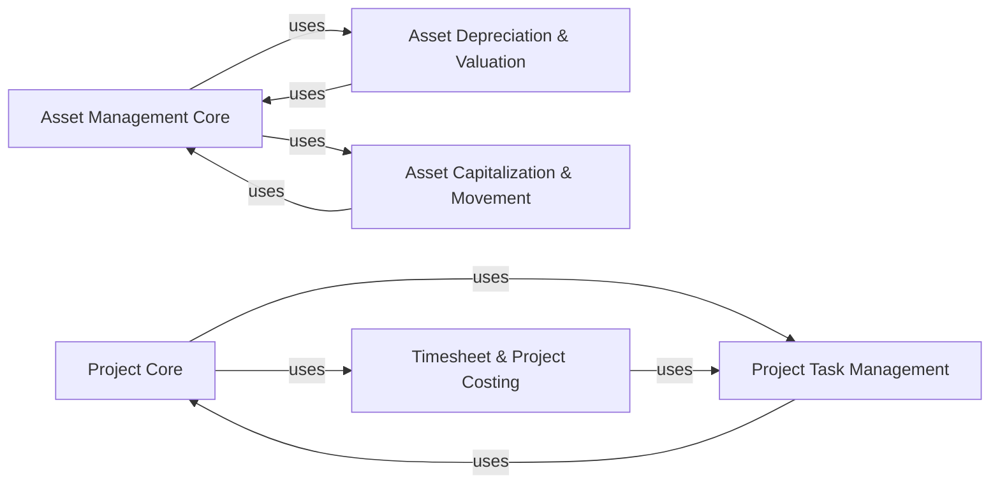

## Component Details

Component overview for Specialized Business Functions (Assets & Projects) in ERPNext, focusing on core components and their interactions for managing fixed assets and project lifecycles.

### Asset Management Core

This is the central component for managing the complete lifecycle of fixed assets. It handles the creation, tracking, and overall status of an asset, serving as the primary record for all asset-related operations. It integrates with financial modules for accounting purposes.

**Related Classes/Methods**:

- <a href="https://github.com/frappe/erpnext/blob/master/erpnext/assets/doctype/asset/asset.py#L1-L1" target="_blank" rel="noopener noreferrer">`erpnext/assets/doctype/asset/asset.py` (1:1)</a>

### Asset Depreciation & Valuation

This component is responsible for the financial aspects of assets, including calculating, scheduling, and posting depreciation entries. It also manages adjustments to an asset's book value, ensuring accurate financial reporting.

**Related Classes/Methods**:

- <a href="https://github.com/frappe/erpnext/blob/master/erpnext/assets/doctype/asset/depreciation.py#L1-L1" target="_blank" rel="noopener noreferrer">`erpnext/assets/doctype/asset/depreciation.py` (1:1)</a>

- <a href="https://github.com/frappe/erpnext/blob/master/erpnext/assets/doctype/asset_depreciation_schedule/asset_depreciation_schedule.py#L1-L1" target="_blank" rel="noopener noreferrer">`erpnext/assets/doctype/asset_depreciation_schedule/asset_depreciation_schedule.py` (1:1)</a>

- <a href="https://github.com/frappe/erpnext/blob/master/erpnext/assets/doctype/asset_value_adjustment/asset_value_adjustment.py#L1-L1" target="_blank" rel="noopener noreferrer">`erpnext/assets/doctype/asset_value_adjustment/asset_value_adjustment.py` (1:1)</a>

### Asset Capitalization & Movement

This component handles the process of adding costs to an asset's value (capitalization) and tracking the physical transfer of assets between locations or custodians. It ensures that the asset's cost basis is accurate and its location is known.

**Related Classes/Methods**:

- <a href="https://github.com/frappe/erpnext/blob/master/erpnext/assets/doctype/asset_capitalization/asset_capitalization.py#L1-L1" target="_blank" rel="noopener noreferrer">`erpnext/assets/doctype/asset_capitalization/asset_capitalization.py` (1:1)</a>

- <a href="https://github.com/frappe/erpnext/blob/master/erpnext/assets/doctype/asset_movement/asset_movement.py#L1-L1" target="_blank" rel="noopener noreferrer">`erpnext/assets/doctype/asset_movement/asset_movement.py` (1:1)</a>

### Project Core

This is the central document for managing projects, encompassing their overall scope, tasks, costs, and progress. It serves as the primary organizational unit for all project-related activities.

**Related Classes/Methods**:

- <a href="https://github.com/frappe/erpnext/blob/master/erpnext/projects/doctype/project/project.py#L1-L1" target="_blank" rel="noopener noreferrer">`erpnext/projects/doctype/project/project.py` (1:1)</a>

### Project Task Management

This component manages individual tasks within a project. It allows for detailed planning, progress tracking, and managing dependencies between tasks, enabling effective project execution and resource allocation.

**Related Classes/Methods**:

- <a href="https://github.com/frappe/erpnext/blob/master/erpnext/projects/doctype/task/task.py#L1-L1" target="_blank" rel="noopener noreferrer">`erpnext/projects/doctype/task/task.py` (1:1)</a>

### Timesheet & Project Costing

This component is responsible for recording the time spent by employees on specific tasks or projects. This data is crucial for tracking project costs, calculating employee utilization, and generating client invoices based on time spent.

**Related Classes/Methods**:

- <a href="https://github.com/frappe/erpnext/blob/master/erpnext/projects/doctype/timesheet/timesheet.py#L1-L1" target="_blank" rel="noopener noreferrer">`erpnext/projects/doctype/timesheet/timesheet.py` (1:1)</a>

### [FAQ](https://github.com/CodeBoarding/GeneratedOnBoardings/tree/main?tab=readme-ov-file#faq)