```mermaid

graph LR

    Financial_Management["Financial Management"]

    Sales_Procurement_Management["Sales & Procurement Management"]

    Inventory_Manufacturing_Operations["Inventory & Manufacturing Operations"]

    Core_System_Master_Data["Core System & Master Data"]

    Specialized_Business_Functions_Assets_Projects_["Specialized Business Functions (Assets & Projects)"]

    Sales_Procurement_Management -- "Receives Transactional Data" --> Financial_Management

    Inventory_Manufacturing_Operations -- "Receives Valuation Updates" --> Financial_Management

    Sales_Procurement_Management -- "Generates Financial Entries" --> Financial_Management

    Sales_Procurement_Management -- "Queries Stock & Item Data" --> Inventory_Manufacturing_Operations

    Inventory_Manufacturing_Operations -- "Posts Stock & Cost Updates" --> Financial_Management

    Inventory_Manufacturing_Operations -- "Provides Stock Availability" --> Sales_Procurement_Management

    Core_System_Master_Data -- "Configures System Behavior" --> Financial_Management

    Core_System_Master_Data -- "Provides Master Data" --> Sales_Procurement_Management

    Specialized_Business_Functions_Assets_Projects_ -- "Generates Financial Entries" --> Financial_Management

    Specialized_Business_Functions_Assets_Projects_ -- "Utilizes Master Data" --> Core_System_Master_Data

    click Financial_Management href "https://github.com/frappe/erpnext/blob/main/.codeboarding//Financial_Management.md" "Details"

    click Sales_Procurement_Management href "https://github.com/frappe/erpnext/blob/main/.codeboarding//Sales_Procurement_Management.md" "Details"

    click Inventory_Manufacturing_Operations href "https://github.com/frappe/erpnext/blob/main/.codeboarding//Inventory_Manufacturing_Operations.md" "Details"

    click Core_System_Master_Data href "https://github.com/frappe/erpnext/blob/main/.codeboarding//Core_System_Master_Data.md" "Details"

    click Specialized_Business_Functions_Assets_Projects_ href "https://github.com/frappe/erpnext/blob/main/.codeboarding//Specialized_Business_Functions_Assets_Projects_.md" "Details"

```

## Component Details

The architecture of `erpnext` can be effectively understood by consolidating its numerous modules into five fundamental components. This consolidation highlights the critical interaction pathways and central responsibilities, providing a high-level data flow overview.

### Financial Management

This component is the central ledger and financial engine of ERPNext. It is responsible for all core accounting operations, including managing the general ledger, processing journal entries, handling payments, performing bank reconciliations, and managing taxation. It ensures the accuracy, integrity, and compliance of all financial records.

**Related Classes/Methods**:

- `erpnext.accounts` (0:0)

- <a href="https://github.com/frappe/erpnext/blob/master/erpnext/controllers/accounts_controller.py#L0-L0" target="_blank" rel="noopener noreferrer">`erpnext.controllers.accounts_controller` (0:0)</a>

- <a href="https://github.com/frappe/erpnext/blob/master/erpnext/controllers/taxes_and_totals.py#L0-L0" target="_blank" rel="noopener noreferrer">`erpnext.controllers.taxes_and_totals` (0:0)</a>

### Sales & Procurement Management

This component manages the entire customer and supplier interaction lifecycle. It covers sales processes from quotations and sales orders to invoicing, and procurement processes from purchase orders to purchase invoices. It also handles party (customer/supplier) master data and applies pricing and promotional rules.

**Related Classes/Methods**:

- `erpnext.selling` (0:0)

- `erpnext.buying` (0:0)

- <a href="https://github.com/frappe/erpnext/blob/master/erpnext/accounts/party.py#L0-L0" target="_blank" rel="noopener noreferrer">`erpnext.accounts.party` (0:0)</a>

- `erpnext.accounts.doctype.pricing_rule` (0:0)

- `erpnext.accounts.doctype.promotional_scheme` (0:0)

- <a href="https://github.com/frappe/erpnext/blob/master/erpnext/controllers/selling_controller.py#L0-L0" target="_blank" rel="noopener noreferrer">`erpnext.controllers.selling_controller` (0:0)</a>

- <a href="https://github.com/frappe/erpnext/blob/master/erpnext/controllers/buying_controller.py#L0-L0" target="_blank" rel="noopener noreferrer">`erpnext.controllers.buying_controller` (0:0)</a>

### Inventory & Manufacturing Operations

This component is dedicated to managing all physical goods within the system. It encompasses item master data, stock levels, various stock movements (receipts, issues, transfers), serial and batch tracking, quality control, and the entire manufacturing process, including Bills of Material (BOMs), work orders, and production planning.

**Related Classes/Methods**:

- `erpnext.stock` (0:0)

- `erpnext.manufacturing` (0:0)

- <a href="https://github.com/frappe/erpnext/blob/master/erpnext/controllers/stock_controller.py#L0-L0" target="_blank" rel="noopener noreferrer">`erpnext.controllers.stock_controller` (0:0)</a>

### Core System & Master Data

This foundational component provides the essential infrastructure, system-wide configurations, and master data that underpin all other modules. It manages core entities like company profiles, item groups, customer groups, and supplier groups, ensuring data consistency and system-wide defaults. It also includes general utility functions and acts as an orchestration layer for cross-module logic.

**Related Classes/Methods**:

- `erpnext.setup` (0:0)

- `erpnext.controllers` (0:0)

### Specialized Business Functions (Assets & Projects)

This component handles specific, yet common, business processes that integrate with the core ERP functionalities. It manages the complete lifecycle of fixed assets, from acquisition and depreciation to disposal. Additionally, it facilitates project planning, task management, time logging, and project-related cost and billing analysis.

**Related Classes/Methods**:

- `erpnext.assets` (0:0)

- `erpnext.projects` (0:0)

### [FAQ](https://github.com/CodeBoarding/GeneratedOnBoardings/tree/main?tab=readme-ov-file#faq)